# Printed Cards export- és vizuális audit

Audit dátuma: 2026-08-08. A „before” rasterek a javítás előtti `91aee5b5`
állapot rendererével, az „after” rasterek ugyanazzal a determinisztikus magyar
fixture-rel, 96 DPI-n készültek.

## Eredmény

- Mind a hat kártya egyetlen `PrintableCardDocument` modellből készül a
  thumbnailben, a nagy HTML-előnézetben és a PDF-ben.
- Az egyszerre indított Exact PDF preview és Download ugyanazt a folyamatban
  lévő, frissen lekért `Blob` példányt használja. A kérés kulcsa: kártyatípus +
  workspace ID + event ID + tartalom- és témarevízió. Befejezett PDF-et nem
  cache-elünk; típus- vagy revízióváltáskor az URL azonnal törlődik.
- A Programkártya saját dekoratív A5 exportja a `/api/print/schedule-card`.
  Az A4 Run of show továbbra is külön, a Schedule oldal számára érhető el a
  `/api/print/schedule` útvonalon.
- A szerver a workspace-t az autentikált sessionből oldja fel; nem fogad el
  kliens által megadható idegen workspace/event ID-t. A dokumentum és a kliens
  cache ettől függetlenül mindkét azonosítót explicit tárolja.
- Loading és üres állapotban lokalizált empty-state jelenik meg, nem valósnak
  látszó seed adat.

### Szerkesztett szöveg utóaudit (2026-08-08)

- A kész PDF Blob csak az egyszerre futó Exact preview + Download kérés között
  oszlik meg. Befejezett Blob nem marad kliens-cache-ben, a PDF fetch explicit
  `cache: "no-store"`, ezért másik böngészőfülön szerkesztett név, menü vagy
  programpont sem ragadhat be a következő exportba.
- A szerver revision hash minden kártyán tartalmazza a tényleges szövegmezőket,
  nem csak az `updated_at` értékeket. Azonos milliszekundumban mentett edit is
  új revisiont kap.
- Hosszú vendégnév, asztalnév, párnév, helyszín és programpont több sorba törik;
  a renderer nem használ ellipszist a nyomtatható kártyákon. A dekoratív font
  határán hibásan eltűnő, tördelés utáni kezdő glyph esetén a teljesen beágyazott
  Noto fallback őrzi meg a szerkesztett szöveget.
- A maximális 6 × 6 soros menü további, azonos stílusú A5 oldalakra folytatódik.
  Egyetlen fogás sem kerül a vágási élen kívülre.
- Az E2E az összes adatforrást a valós HTTP writeren módosítja, mind a hat PDF-et
  újra lekéri, `pdftotext`-tel ellenőrzi a teljes új szöveget és a régi szöveg
  hiányát, majd `-bbox` koordinátákkal bizonyítja, hogy minden szövegdoboz a
  fizikai oldalon belül marad.

## Komponens- és útvonaltérkép

| Kártyaazonosító | Thumbnail / HTML preview | PDF-template | Export endpoint |
| --- | --- | --- | --- |
| `place_card` | `PrintCardPreview` | `renderPlaceCardsPdf` (A4, 2×5 batch) | `/api/print/place-cards` |
| `table_number` | `PrintCardPreview` | `renderTableNumbersPdf` (A6) | `/api/print/table-numbers` |
| `menu` | `PrintCardPreview` | `renderMenuPdf` (A5) | `/api/print/menu` |
| `invitation` | `PrintCardPreview` | `renderInvitationPdf` (A5) | `/api/print/invitation` |
| `thank_you` | `PrintCardPreview` | `renderThankYouPdf` (A6) | `/api/print/thank-you` |
| `schedule` | `PrintCardPreview` | `renderScheduleCardPdf` (A5) | `/api/print/schedule-card` |

A típusbiztos mapping a `shared/print_cards.ts` egyetlen, exhaustive
registryjében van. Ismeretlen azonosító explicit hibát dob; nincs fallback az
előző vagy egy általános PDF-re. Minden kártya-endpoint a közös
`renderPrintableCardPdf` belépési pontot használja.

## Kanonikus adatforrások

| Tartalom | Adatforrás |
| --- | --- |
| Pár neve | `couples.display_name`, fallbackként a két partner neve |
| Dátum | `couples.wedding_date`, a design date-formatjával és a user locale-jával |
| Helyszín | `couples.venue_name`, `couples.venue_city` |
| Menü | `couples.menu_card` normalizált kurzusai, megtartott sorrendben |
| Program | `schedule_events`, a kanonikus `pickKeyMoments` választással és időrendben |
| Vendég | `guests.full_name` |
| Asztal | `seating_tables.label` + `seat_assignments` |
| Locale | az autentikált user locale-ja (`en`, `hu`, `es`, `hr`, `de`) |
| Timezone | a workspace országa; HU esetén `Europe/Budapest` |

A dátum csak dátumként, a programidő pedig a wedding-day lokális éjféltől mért
percként tárolódik, ezért nincs böngésző/server timezone-eltolódás. A `1440+`
időpontok `HH:MM+1` alakban jelennek meg.

## Valódi gyökérok

A PDF-et `pdf-lib` + `@pdf-lib/fontkit` készíti; a böngészős CSS és a headless
fontbetöltés nem része ennek az exportútnak. A hibát külön diagnosztikai PDF-fel
reprodukáltuk:

1. A régi Cormorant Garamond / Cormorant SC / EB Garamond TTF-ek
   `subset: true` beágyazásánál a PDF szövegoperátorai és a ToUnicode map
   helyesek maradtak, ezért a `pdftotext` teljes szöveget adott.
2. A CFF subset glyph-kontúrjai viszont sérültek: Poppler rasteren csak néhány
   karakter, tipikusan az `&` vagy egyetlen kezdőbetű maradt.
3. Ugyanezeknek a régi fájloknak a teljes beágyazása font-table offset
   `RangeError` hibával leállt.
4. A betűcsaládok hivatalos statikus OTF buildje teljes beágyazással hibátlanul
   rasterizálja a kötelező magyar és hosszú név fixture-t.

Ezért nem másik dizájnfont került a kártyákra. A Garden továbbra is Cormorant
Garamond Italic, a Noir Cormorant SC + EB Garamond. A problémás három OTF
`subset: false`, a biztonságosan subsetelhető Jost/DM Sans/Bodoni/Crimson/Noto
fájlok továbbra is részhalmazolhatók. Példa `pdffonts` eredmény:

```text
CormorantGaramond-Italic  CID Type 0C (OT)  Identity-H  yes  no  yes
```

Vagyis a font beágyazott, nem subsetelt és Unicode mapet tartalmaz.

## Méret-, overflow- és thumbnail-audit

- A PDF fizikai méretet közvetlenül PDF pontban kap; nem a skálázott preview
  DOM-ját nyomtatja.
- A display-szöveg szélességét azzal a konkrét beágyazott fonttal mérjük,
  amellyel rajzoljuk. Hosszú név shrinkel, menü- és programcím legfeljebb két
  sorra törik; a helper nem csonkol karaktert.
- A React preview `break-words`, explicit line-height és `max-w-full`
  szabályokat használ. Nincs `clip-path`, mask, negatív margó vagy print-CSS.
- A hat thumbnail azonos `3/4` grid-canvasban van; a fekvő lap középre kerül.
  A canvas `overflow-visible`, így a selected border és az eltolással rajzolt
  papírlapok sem vágják le a kártyát. A címkék azonos vonalra kerülnek.
- A 4 border × 2 divider állapot mind a hat típuson automatizált renderpróbát
  kapott (48 kombináció).

## Automatizált védelem

Az alábbi ellenőrzések futnak:

- registry, ismeretlen típus elutasítása, view-model mapping, öt locale dátuma,
  timezone és empty-state unit teszt;
- mind a hat valódi HTTP endpoint státusz/MIME/méret/oldalszám ellenőrzése;
- `pdfinfo`, `pdffonts`, `pdftotext`, majd `pdftoppm` minden kártyán;
- 11 Unicode/hosszú/kötőjeles/aposztrófos vendég kétoldalas Place-card batchben;
- Schedule-card ≠ Run of show assertion;
- Exact preview + Download egyetlen fetch/Blob regressziós teszt;
- hat kártyatípus + külön empty-menu, 96 DPI-s, gzipelt PPM pixel-baseline;
- külön magyar Unicode fixture a Place-card baseline-ban és hosszú tartalmú
  fixture a Menu/Schedule baseline-ban.

A baseline nem frissül automatikusan. A script szándékosan hibát dob, ha nincs
explicit, review utáni kapcsoló:

```bash
cd backend
bun scripts/update_printed_card_baselines.ts --update
bun test tests/printed_cards.test.ts tests/printed_cards_visual.test.ts \
  tests/api/printed_cards.e2e.test.ts
cd ../frontend
bun test tests/pages/printed_cards.test.tsx
```

## Előtte–utána rasterek

| Kártya | Előtte | Utána |
| --- | --- | --- |
| Place card | 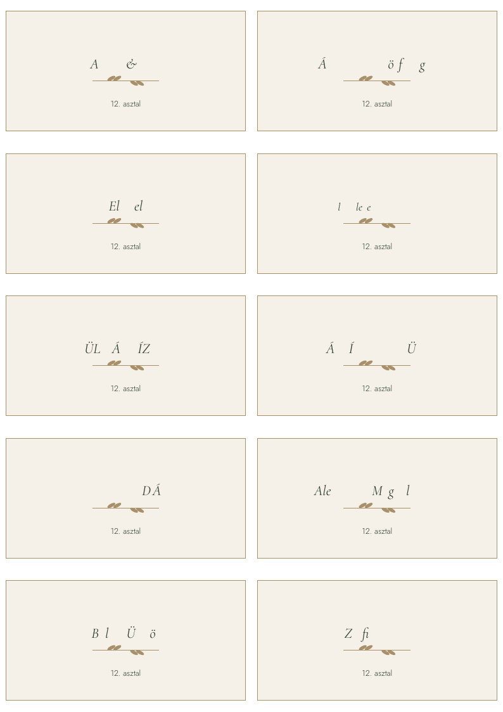 | 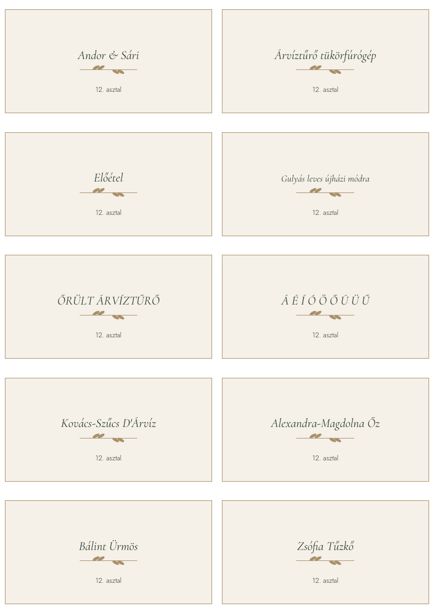 |
| Table number | 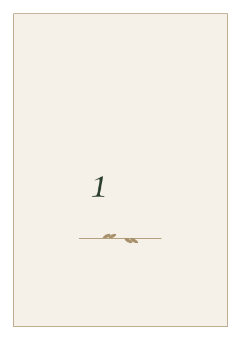 | 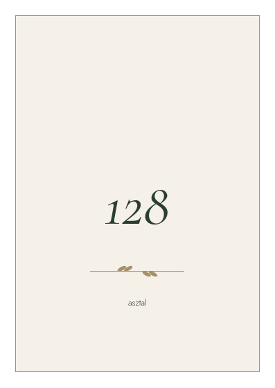 |
| Menu | 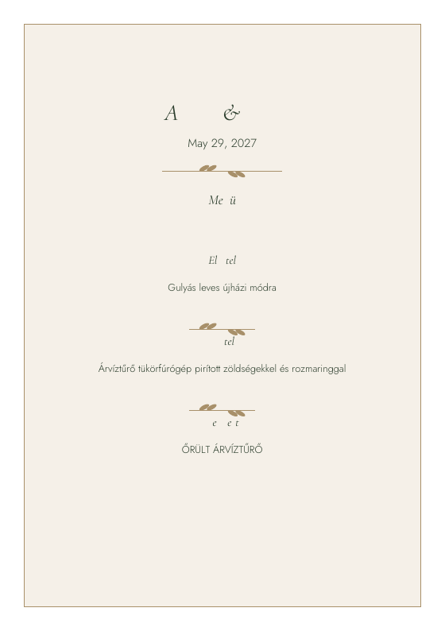 | 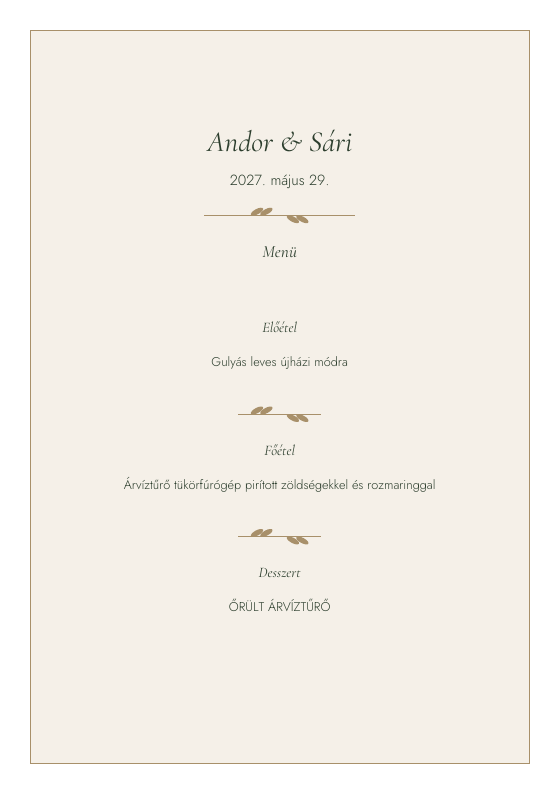 |
| Invitation | 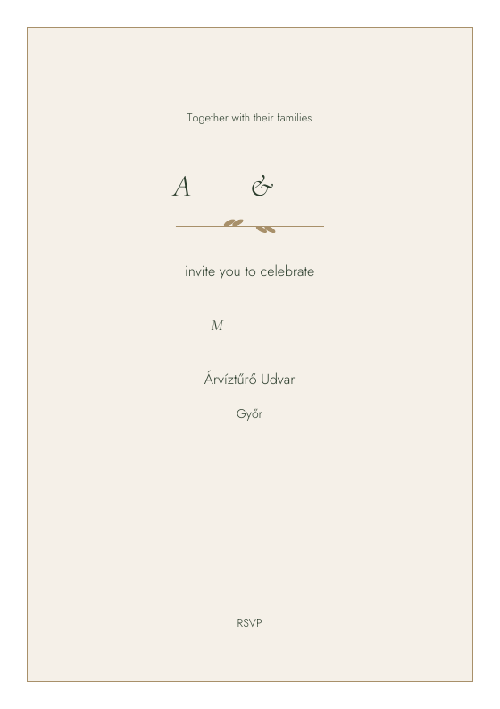 | 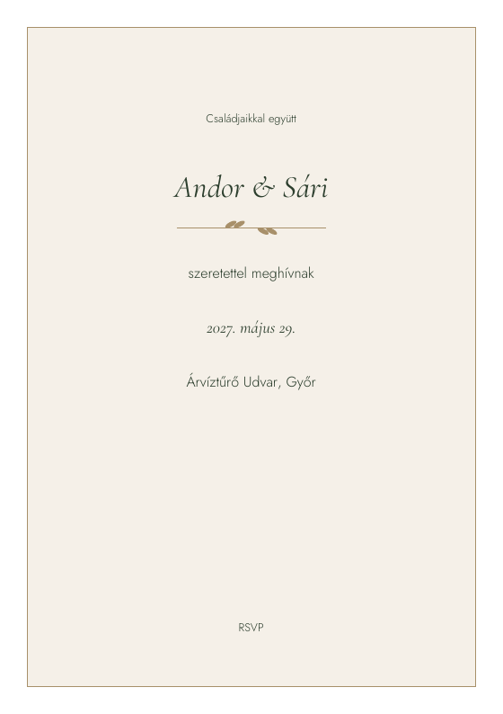 |
| Thank-you | 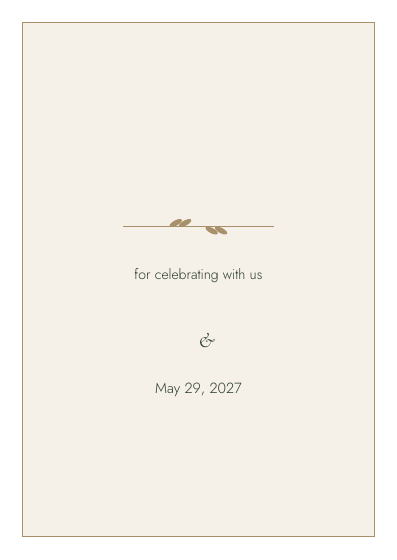 | 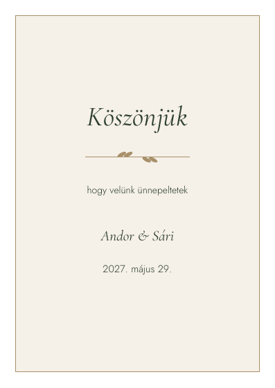 |
| Schedule | 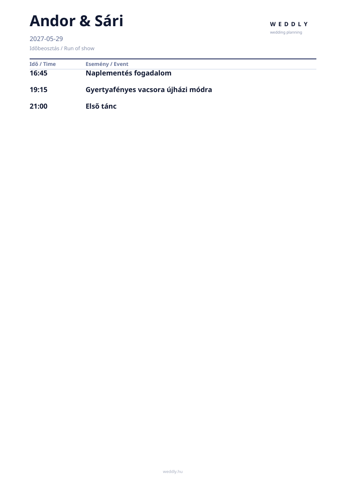 | 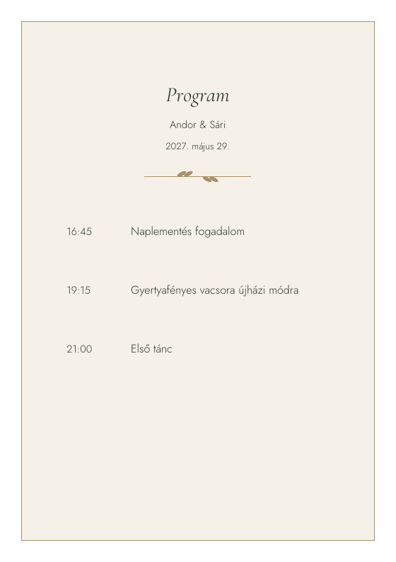 |

## Kézi QA státusz

Az automatizált Poppler/CI audit kész. A Chrome PDF viewer, macOS Preview,
Adobe Acrobat, 100/200% zoom és fizikai nyomtatás operátori ellenőrzését a PR
review során kell aláírni; ezek nem szimulálhatók hitelesen headless tesztből.
Az ellenőrzéshez az `after/` hat rastere és a tesztfixture azonosítója
`visual-workspace / visual-event / visual-v1`. A baseline-frissítés csak e kézi
review után fogadható el.
